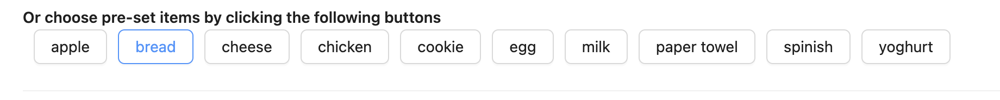
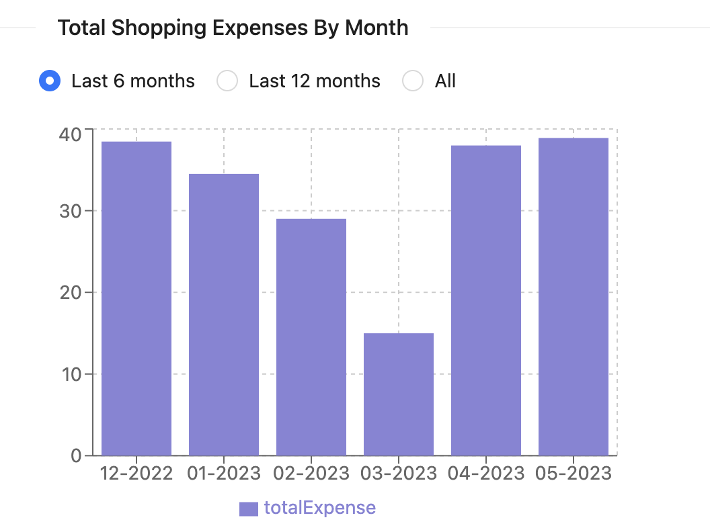

# Shopper-Helper 
  
## Description

Shopper-Helper is a shopping assist tool designed for shoppers to easily create their shopping list, viewing item status, tracking shopping history, set up their favourite/commonly bought items and shops, and checking the statistics for their shopping trends.

## Table of Contents

- [Technologies](#technologies)
- [Usage](#usage)
- [Deployment](#deployment)
- [Questions](#questions)

--------------------------------------------------------

## Technologies

Shopper-Helper is mainly created with the following technologies:
- HTML
- CSS
- JavaScript
- React.js
- Node.js
- Express.js
- GraphQL
- MongoDB/Mongoose
- JWT
- Ant Design
--------------------------------------------------------

## Usage

### **1. Homepage**
The homepage is divided mainly into the following sections:
- Header and Navigation Bar, which are also used in every other page
- Shopping item input area
- Pre-set commonly bought items' tags area
- Shopping list presenting area

#### **i. Shopping item input area**
The shopping item input area is designed for users to manually input the items, including item name (required field), quantity, unit, shop and price. For unit and shop, users can simply choose from the pre-set options or manually type in. And by clicking the add button, the item will be added in the current shopping list which presented in the shopping list area. 
  
#### **ii. Pre-set commonly bought items tags area**
The pre-set commonly bought items tags area contains all the pre-set items which are set by the user in the setting page in ascending order by alphabet, so for those goods which users buy very offen with same quantity and in same shop, they can set it as pre-set item and then can add to the shopping list by simply clicking the item's tag.  

#### **iii. Shopping list presenting area**
The shopping list presenting area contains all the items user added from the item input area and preset tags area, all the features other than the name are editable, so users can easily change it base on the live situation while doing the real shopping. 

There is a pending button on the right side of each transaction, users can click it after they buy a certain item to mark it bought, so it will be very obvious how many items are left to be bought. If they feel they don't need some item during the shopping, they can click the x to delete the transaction. 

### **2. Historical Lists**
The historical lists page is for users to track their shopping history. By default, the page shows all the shopping lists by date in descending order. 

By clicking each title, the collaps will extend and show the full list with the total price for the day. 

And there is also a date range option which users can choose a date range and check only the shopping history with the range or on a certain date.

### **3. Statistics**
The statitics page gives a summary of total spending by date and by month. 
By date, there are options of checking the daily expenses trend for the past 3 months, past 6 months and all.

By month, there are options of checking the monthly expense trend for the past 6 months, past 12 months and all.

### **4. Settings**
The setting page contains two tabs: setting for the pre-set items and setting for the pre-set shops.

#### **i. Pre-set Items**
Under the pre-set item tab, users can set up the items they often buy by click the add new item button, then a new line will be added to the bottom of the list. After fill in the item information and click finish, the new item will be added. 

And there is also an edit funtion for users to edit a certain item if for example the price changes, or delete one item if it is not needed anymore. 

After the settings done, the user can click the save changes button to save all the changes to the database, then the item tag area on homepage will automatically reflect the updates. 

#### **ii. Pre-set Shops**
Similar to pre-set items, the pre-set shop tab allows users to add, edit or delete shops which they normally shopping in, and these updates will be done on the shop tags. 

And same as pre-set items, after click save changes button, the updates will also be reflected on the item input and shopping list section for the shop options selecting. 

### **5. Login and Signup pages**
Since the whole application needs to be logged in to use, if users try to reach the url of the pages without logged in, they will be redirect to the login page. They can also click the register link if they havn't signup yet.

--------------------------------------------------------

## Deployment

--------------------------------------------------------

## Questions

If you have additional questions, please contact me at: 

My github link: https://github.com/gulama2008

My email address: siyu.liu.job@gmail.com